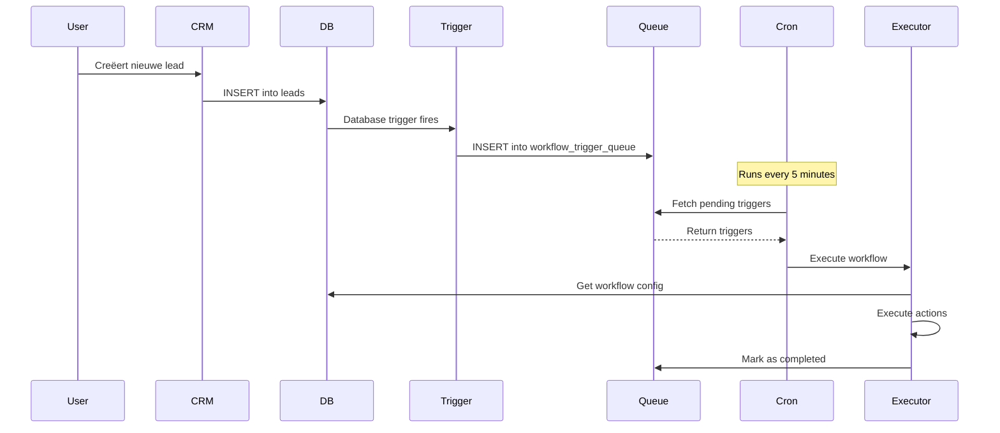

# Workflow Automation Architecture

## Overzicht

Het workflow automation systeem werkt met een combinatie van client-side UI en server-side execution:

```
┌─────────────┐     ┌──────────────┐     ┌─────────────┐
│   Browser   │────▶│   Next.js    │────▶│  Supabase   │
│  (Builder)  │     │   API/SSR    │     │  Database   │
└─────────────┘     └──────────────┘     └─────────────┘
                           │                      │
                           ▼                      ▼
                    ┌──────────────┐     ┌─────────────┐
                    │   Netlify    │     │  Database   │
                    │  Functions   │────▶│  Triggers   │
                    │ (Cron Jobs)  │     │   (PG)      │
                    └──────────────┘     └─────────────┘
```

## Componenten

### 1. **Frontend Builder** (Client-side)
- **Locatie**: `/app/dashboard/automations` & `/app/dashboard/workflows`
- **Tech**: React Flow voor visual builder
- **Functie**: Workflows ontwerpen en configureren
- **Opslag**: Config wordt als JSON in database opgeslagen

### 2. **Database Triggers** (PostgreSQL)
- **Locatie**: `supabase/migrations/20250817_workflow_execution_tables.sql`
- **Triggers**:
  - `trigger_workflow_on_lead_created` - Bij nieuwe lead
  - `trigger_workflow_on_lead_status_change` - Bij status wijziging
  - `trigger_workflow_on_form_submission` - Bij form inzending
- **Functie**: Real-time events detecteren en in queue plaatsen

### 3. **Workflow Executor** (Server-side)
- **Locatie**: `src/lib/workflow/executor.ts`
- **Functie**: Voert workflow acties uit (email, SMS, tasks, etc.)
- **Features**:
  - Variable replacement (`{{lead.name}}`)
  - Wait/delay handling
  - Condition evaluation
  - Error handling & retry

### 4. **Queue System**
- **Table**: `workflow_trigger_queue`
- **Features**:
  - Retry logic (max 3 attempts)
  - Status tracking
  - Error logging
  - Priority handling

### 5. **Cron Job** (Netlify Scheduled Function)
- **Locatie**: `netlify/functions/workflow-cron.ts`
- **Schedule**: Elke 5 minuten
- **Functie**: 
  - Haalt pending triggers uit queue
  - Roept executor aan voor elk item
  - Verwerkt scheduled jobs (wait acties)

### 6. **Webhook Endpoint**
- **Locatie**: `src/app/api/webhooks/workflow/route.ts`
- **URL**: `/api/webhooks/workflow?key=YOUR_KEY`
- **Functie**: Externe triggers (Zapier, Make.com, custom forms)

## Workflow Execution Flow



## Environment Variables

```env
# Database (automatic via Supabase)
NEXT_PUBLIC_SUPABASE_URL=your-url
NEXT_PUBLIC_SUPABASE_ANON_KEY=your-anon-key
SUPABASE_SERVICE_KEY=your-service-key

# Email
RESEND_API_KEY=your-resend-key
RESEND_FROM_EMAIL=noreply@yourcompany.com

# SMS
MESSAGEBIRD_API_KEY=your-messagebird-key
MESSAGEBIRD_ORIGINATOR=YourCompany

# Security
WORKFLOW_SECRET_KEY=random-secret-for-cron
WEBHOOK_SECRET=random-secret-for-webhooks

# Cron (Vercel only)
CRON_SECRET=random-secret-for-vercel
```

## Deployment Considerations

### Netlify
- Scheduled functions worden automatisch gedetecteerd
- Cron syntax in function naam: `workflow-cron.ts`
- Max execution time: 10 seconds (upgrade voor langer)

### Vercel
- Gebruik `vercel.json` voor cron config:
```json
{
  "crons": [{
    "path": "/api/cron/workflow",
    "schedule": "*/5 * * * *"
  }]
}
```

### Database
- Run migrations: `npx supabase migration up`
- Enable database triggers
- Set proper RLS policies

## Security

1. **API Authentication**: Secret key voor cron jobs
2. **Webhook Verification**: Optional signature verification
3. **RLS Policies**: Service role voor execution tables
4. **Input Validation**: Sanitize user input in workflows

## Monitoring

- Check `workflow_executions` table voor history
- Monitor `workflow_trigger_queue` voor backlog
- Set alerts op failed executions
- Log belangrijke events

## Scaling

Voor high-volume:
1. Verhoog cron frequency (elke minuut)
2. Process meer items per run (limit aanpassen)
3. Gebruik dedicated queue service (BullMQ, SQS)
4. Shard workflows over multiple workers

## Testing

```bash
# Test manual trigger
curl -X PUT http://localhost:3000/api/workflows/execute \
  -H "Content-Type: application/json" \
  -d '{"workflowId": "your-workflow-id", "triggerData": {"test": true}}'

# Test webhook
curl -X POST http://localhost:3000/api/webhooks/workflow?key=test-key \
  -H "Content-Type: application/json" \
  -d '{"name": "John Doe", "email": "john@example.com"}'
```